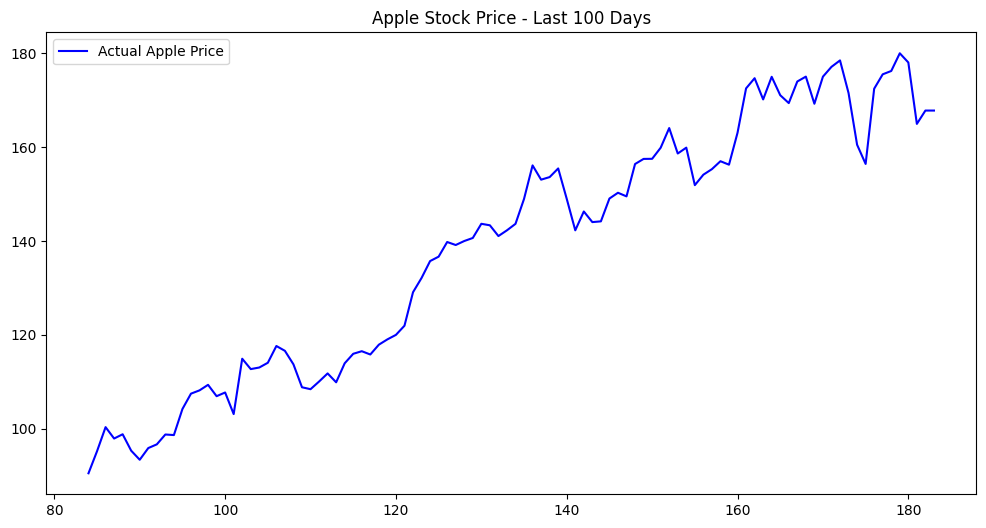

# Apple Stock Price Prediction using LSTM

This project implements a Deep Learning model to predict Apple Inc. (AAPL) stock prices using Long Short-Term Memory (LSTM) networks.

## 📊 Results

*The graph above shows the comparison between the actual stock prices and the model's predictions.*

## 🛠️ Tech Stack
- **Language:** Python
- **Libraries:** TensorFlow/Keras, Pandas, NumPy, Matplotlib, Scikit-learn
- **Environment:** Google Colab / Linux

## 🚀 Features
- Real-time data fetching using Yahoo Finance API.
- Data preprocessing and normalization.
- Multi-layer LSTM architecture for time-series forecasting.
- Visualization of prediction results.

## 📁 Project Structure
- `src/`: Source code for training, preprocessing, and visualization.
- `models/`: Saved trained models (.h5).
- `requirements.txt`: Project dependencies.
